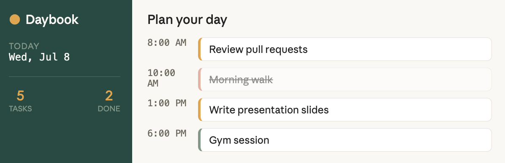

# 🗓️ Daybook — a simple daily planner

A minimal, local-first daily planner built with vanilla HTML, CSS, and JavaScript — no frameworks, no build step. Plan your day on an hourly timeline, tag tasks by category, and track completion. All data is saved to your browser's `localStorage`, so your plan is still there when you come back.

> **Note:** This repo's main purpose is to demonstrate a clean GitHub workflow — issues, branches, pull requests, and documentation — not to be a finished, polished product. The core planner works, but you'll see open issues and in-progress features here on purpose, as a record of ongoing development rather than a single finished dump.

## ✨ Features

- **Hourly timeline view** (6 AM – 11 PM) — add tasks directly to a time slot
- **Categories** (Work / Personal / Health) with color-coded tags
- **Today's focus** — pin the one thing that matters most today
- **Live stats** — total tasks, completed, and % complete
- **Persistent state** — tasks survive page reloads via `localStorage`
- **Fully responsive** — works down to mobile widths
- **No dependencies** — open `index.html` and it just works

## 🔧 How this repo is being developed

Rather than uploading a finished project in one commit, this repo is built the way a real (small) team would work:

- Features and fixes start as an **Issue** describing what's needed and why
- Work happens on a **feature branch**, not directly on `main`
- Changes are proposed via **Pull Request**, with a description of what changed and why
- The PR is merged once it's ready, closing the linked issue automatically

You'll find the full history of this under the repo's **Issues** and **Pull Requests** tabs — that history is as much the point of this repo as the app itself.

## 🖥️ Demo



## 🛠️ Tech stack

| Layer | Choice |
|---|---|
| Structure | HTML5 |
| Styling | CSS3 (custom properties, Grid, Flexbox) |
| Logic | Vanilla JavaScript (ES6+) |
| Persistence | Browser `localStorage` |
| Fonts | Barlow Condensed, Inter, JetBrains Mono (Google Fonts) |

No build tools, no package manager, no frameworks — intentionally, to keep the project approachable and dependency-free.

## 📦 How to run

Clone the repo and open the file directly — that's it:

```bash
git clone https://github.com/YOUR_USERNAME/daily-planner.git
cd daily-planner
open index.html   # or just double-click it
```

Or serve it locally with any static server, e.g.:

```bash
python3 -m http.server 8000
```

Then visit `http://localhost:8000`.

## 📁 Project structure

```
daily-planner/
├── index.html          # Page structure and markup
├── css/
│   └── style.css        # All styling, organized by section
├── js/
│   └── script.js         # App logic (state, rendering, events)
├── .gitignore
├── LICENSE
└── README.md
```

## 🎯 What I learned

- Structuring vanilla JS around small, single-purpose functions (`addTask`, `renderTimeline`, `renderStats`) instead of one large script
- Using `localStorage` safely with try/catch for a smoother first-load experience
- Designing an interface around the actual subject matter (a timeline "ruler") rather than a generic card grid
- Writing accessible markup — labeled inputs, `aria-label`s on icon-only buttons, visible focus states, and respecting `prefers-reduced-motion`
- Using Issues, branches, and Pull Requests deliberately, even solo — planning a change, isolating it on a branch, and merging it with a documented PR instead of pushing straight to `main`

## 🔭 Open / in progress

Tracked as open issues in this repo rather than a static list here — check the **Issues** tab for the current state, for example:

- Drag-and-drop to reschedule tasks between hours (in progress)
- Multi-day view / week navigation
- Export day plan as text or image
- Dark mode toggle

## 📄 License

This project is licensed under the MIT License — see [LICENSE](LICENSE) for details.
